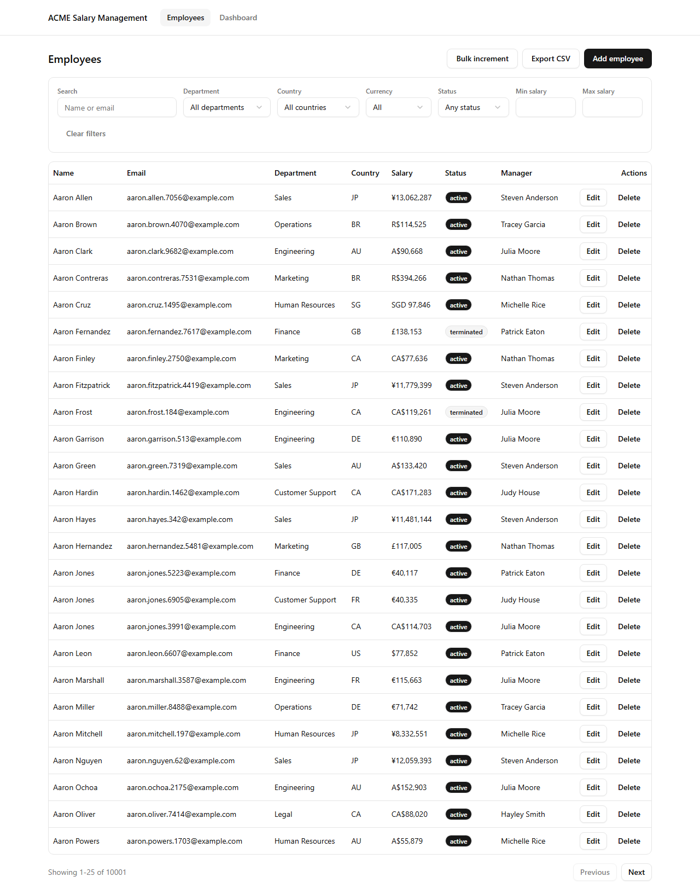
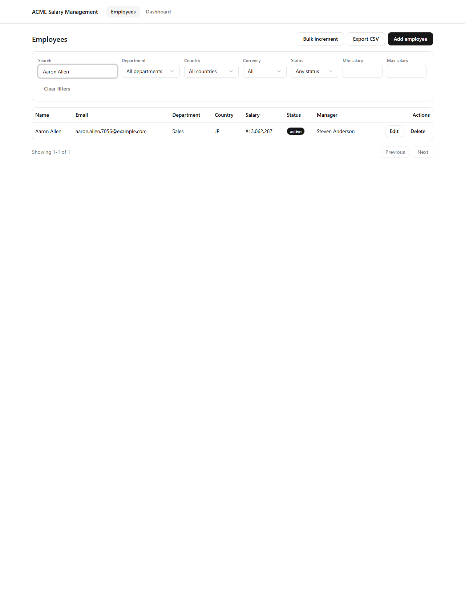
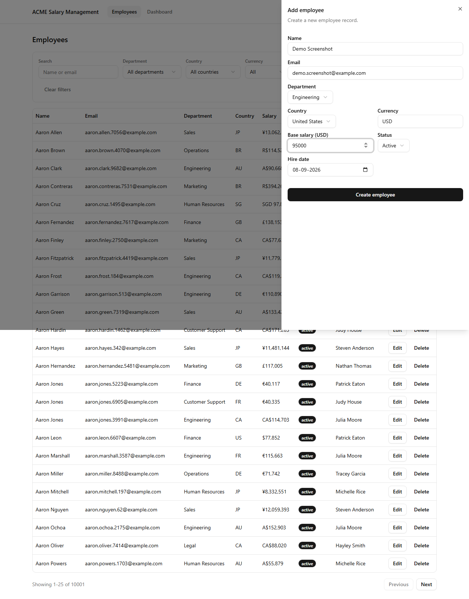
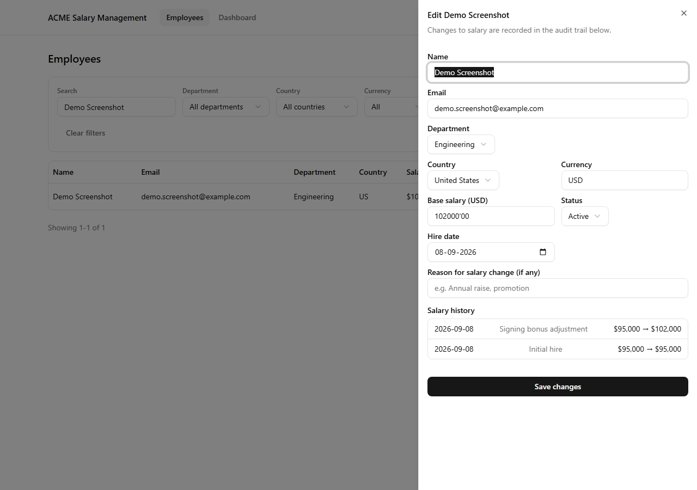
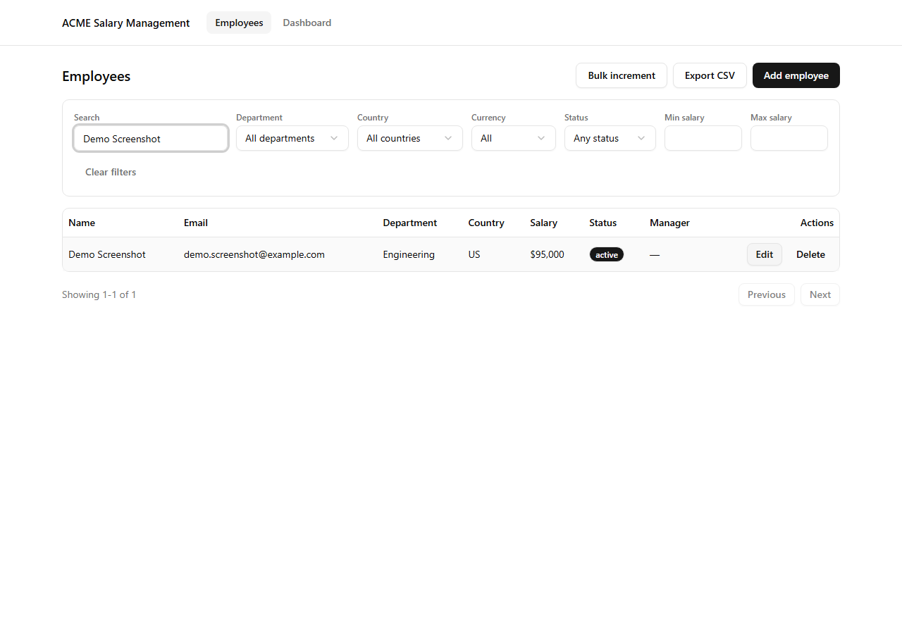
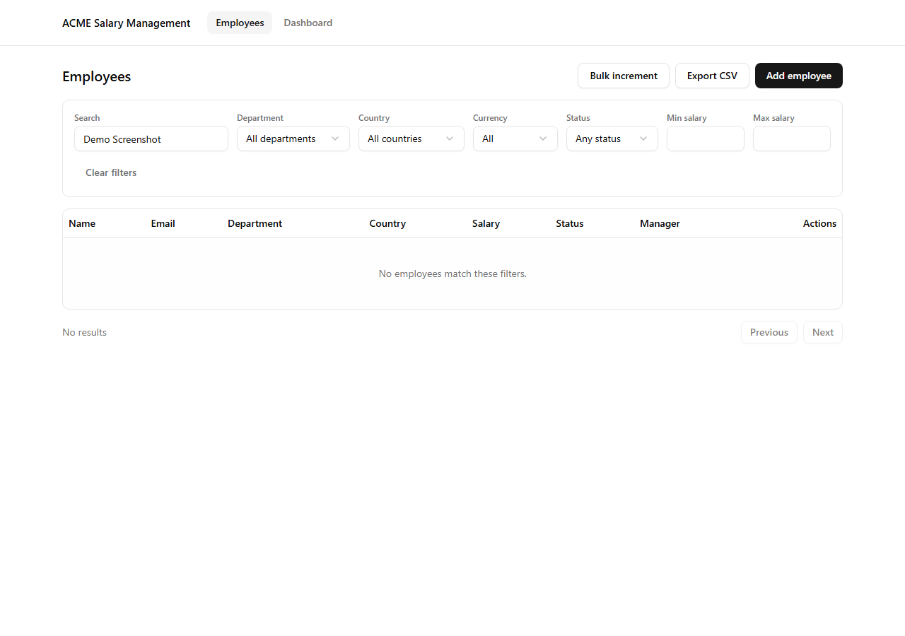
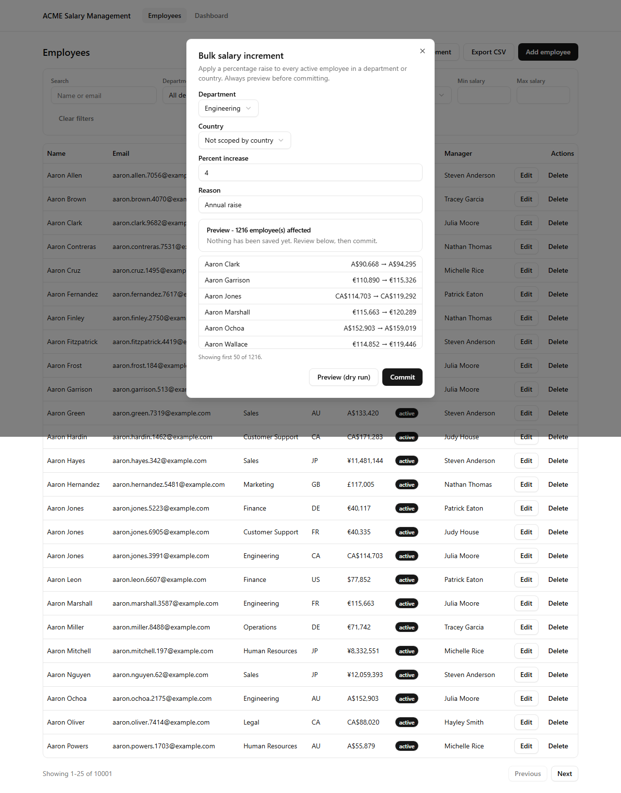
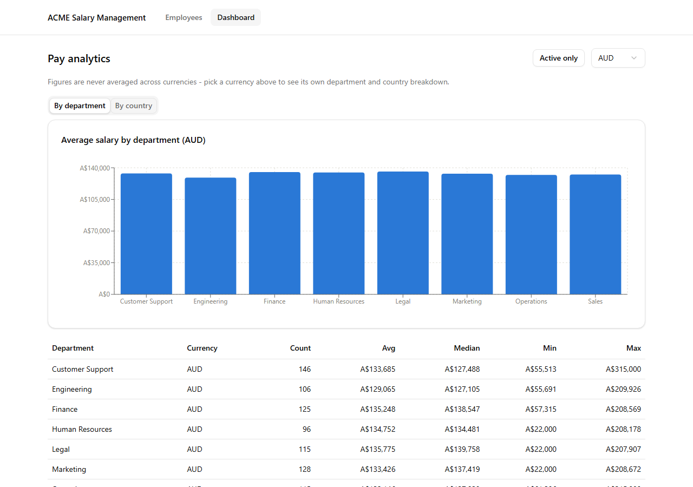
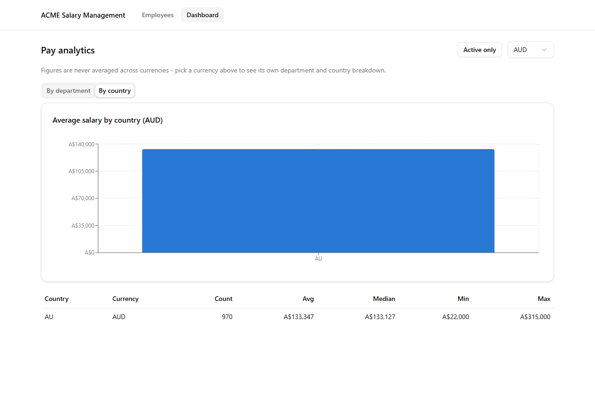

# Employee Salary Management

Web-based salary management for an HR Manager at a 10,000-employee, multi-country org. Replaces spreadsheet-based salary tracking with a searchable, filterable system plus salary-by-department/country analytics.

- **Live app**: https://client-gamma-three-46.vercel.app
- **API**: https://acme-salary-api-lxpc.onrender.com/api/ (health check: [`/api/health/`](https://acme-salary-api-lxpc.onrender.com/api/health/))
- **Screen recording**: [docs/media/demo.webm](docs/media/demo.webm)

Free-tier Render web services spin down after ~15 min idle - the first API request after a while can take 30-50s to wake up.

## Stack
- **Server**: Python, Django + Django REST Framework, PostgreSQL
- **Client**: React + Vite + TypeScript, shadcn/ui, TanStack Table/Query, Recharts
- **Tests**: pytest (server, 48 tests), Vitest + React Testing Library (client, 24 tests)
- **Deploy**: Render (API + Postgres), Vercel (client)

## Repo layout
```
server/   Django project (API, models, seed command, tests)
client/   React app (UI)
docs/     requirements, architecture, trade-offs, demo notes, screenshots
```

## Docs
- [Requirements](docs/requirements.md) - scope, and what's deliberately left out
- [Architecture](docs/architecture.md) - data model, API surface, key design decisions
- [Trade-offs & demo notes](docs/trade-offs.md) - including two real bugs found via testing

## Screens

**Employee list - filter, search, paginate over 10k records**


**Search filter narrows the same list**


**Create employee**


**Edit employee - salary changes recorded in an append-only audit trail**


**Delete employee - before and after**

| Before | After |
|---|---|
|  |  |

**Bulk salary increment - dry-run preview before committing**


**Dashboard - currency-segmented pay analytics, by department and by country**

| By department | By country |
|---|---|
|  |  |

## Local setup

### Server
```bash
cd server
python -m venv venv
venv/Scripts/activate      # venv\Scripts\activate on native Windows shells
pip install -r requirements.txt
python manage.py migrate
python manage.py seed_employees      # seeds 10,000 employees, ~1 min
python manage.py runserver 8000
```
Runs on SQLite by default - no local Postgres install needed. Set `DATABASE_URL` (see `server/.env.example`) to point at Postgres instead.

### Client
```bash
cd client
npm install
npm run dev      # http://localhost:5173, expects the API at http://127.0.0.1:8000/api
```

### Tests
```bash
cd server && pytest
cd client && npm test
```
